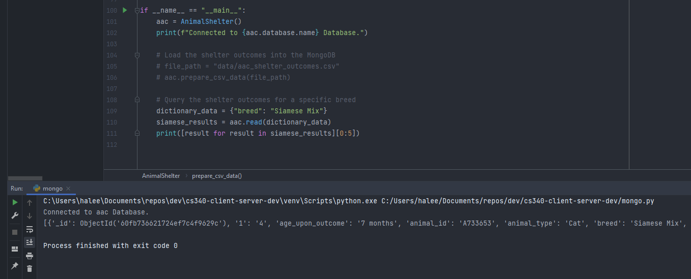

# README cs340-client-server-dev
Repo to store Python and MongoDB code for Client/Server Development

## About the Project
This module fulfills the following objectives:
1. a method that inserts a document into a specified MongoDB database (`create`)
2. a method that queries for documents from a specified MongoDB database and specified collection (`read`)
3. applies industry standard best practices such as naming conventions, exception handling, and in-line comments

## Motivation
The motivation behind the creation and maintenance of the project is to create a Python module that enables create and read functionality on a MongoDB.

## Getting Started
To set up the project locally, follow the steps outlined in **Installation** and **Environment Variables** section.

### Installation
- In PyCharm, create a Virtual Environment by navigating to `Settings` > `Projects` > `Project Interpreter` > Clicking the `Cog` icon in the top right > Click "`Add`" > Ensure the new `venv` box is checked > Click "`OK`" > Click "`OK`" again
- Install the requirements file by typing `pip install -r requirements.txt` in the terminal.
- Pymongo has some additional dependencies which can be installed with the following command: `python -m pip install pymongo[snappy,gssapi,srv,tls]`

### Environment Variables
Create a `.env` file in the root of this repo and fill in the following environment variables.

```dotenv
MONGO_HOST = "cluster"
MONGO_PORT = "###"
MONGO_DB = "aac"
MONGO_USER = "user"
MONGO_PASS = "pass"
```

## Usage
To run the code locally, follow the **Getting Started** steps and then run `mongo.py`.


## Code Example
Run `mongo.py` to connect to the database, insert, and read a document.

```python
if __name__ == "__main__":
    import csv
    import logging
    import os
    from dotenv import load_dotenv
    from pymongo import MongoClient
    
    # Connect to the database
    aac = AnimalShelter()
    print(f"Connected to {aac.database.name} Database.")

    # Load the shelter outcomes into the MongoDB
    file_path = "data/aac_shelter_outcomes.csv"
    aac.prepare_csv_data(file_path)

    # Query the shelter outcomes for a specific breed
    dictionary_data = {"breed": "Siamese Mix"}
    siamese_results = aac.read(dictionary_data)
    print([result for result in siamese_results][0:5])
```

## Tests
Unit tests have not yet been implemented in this project.

## Screenshots
The following screenshot demonstrates how to run the `mongo.py` file.



## Contact
Arys Pena